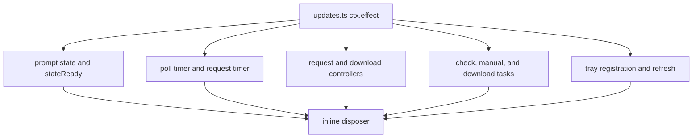
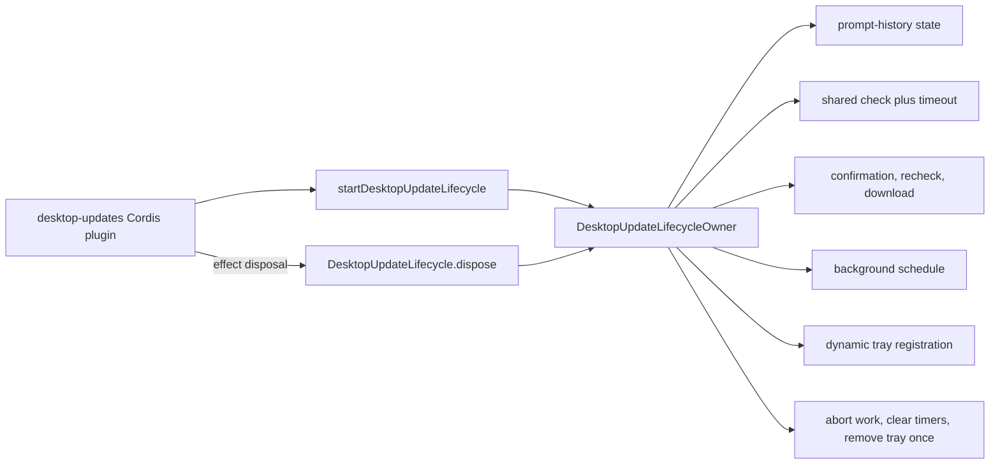

# Agent Note: Desktop update lifecycle ownership

Status: implemented

English | [中文](2026-08-19-desktop-update-lifecycle-ownership.zh.md)

## Problem

The `desktop-updates` Cordis plugin coordinates scheduled checks, manual checks, confirmation, download handoff, prompt-history persistence, dynamic tray state, timeouts, cancellation, and disposal. Before this change, all mutable state lived in one `ctx.effect()` closure in `updates.ts`: two timers, two `AbortController` instances, three single-flight tasks, persisted state readiness, availability state, and the tray registration.

The plugin interface was small, but the implementation made lifecycle correctness difficult to inspect. Understanding whether one Host generation released all update work required reading every nested function and matching each state variable with its cleanup path. The update operation already had one natural lifetime, so its state belonged behind one generation-scoped seam.

## Decision

Keep the public `desktop-updates` Cordis plugin and its exported `Config` unchanged. Add a private `DesktopUpdateLifecycle` Module whose interface is:

```ts
startDesktopUpdateLifecycle(options): DesktopUpdateLifecycle
DesktopUpdateLifecycle.dispose(): Promise<void>
```

The Module owns:

- prompt-history loading, validation, replacement, and optional persistence;
- background scheduling and request timeout timers;
- shared manual/background version checks;
- confirmation followed by a fresh version check;
- one active download and its cancellation controller;
- available/downloading tray presentation and its registration;
- serializable native-notification action registration, invocation, and release;
- generation disposal, including idempotent cancellation, notification-action release, and tray removal.

`updates.ts` now validates Cordis configuration, starts one lifecycle in one effect, and delegates effect disposal to the returned handle. It does not inspect or mutate lifecycle state.

## Before / after

Before, one plugin closure exposed many parallel ownership paths:



After, the Cordis plugin has one generation-scoped lifecycle handle:



The interface is smaller than the implementation and gives the caller leverage: one start operation establishes all update behavior, and one disposal operation releases the generation. Deleting the Module would move its state and cleanup rules back into `updates.ts`, so it earns its seam.

## Lifecycle invariant

For one update lifecycle generation:

1. At most one version-check request is active; manual and background callers share it.
2. At most one confirmation/download task is active.
3. A confirmed version is checked again before download handoff.
4. Background discovery registers the `open-update` action, records the version before notifying, and does not repeat the notification for the same persisted version.
5. Clicking the action enters the same confirmation and fresh-check path as the tray command, while repeated clicks share the existing manual/download tasks.
6. Disposal marks the generation inactive before releasing the notification action, clearing timers, aborting requests/downloads, and removing the tray item.
7. Disposal waits only for state readiness and the abortable version request; native dialogs remain non-cancellable and do not block Host release.
8. Repeated disposal returns the same task, releases the notification action and tray item once, and cannot restart polling.

## Preserved behavior and limits

- The update state is version 3 with the same 4 KiB read limit and atomic best-effort persistence; version-2 prompt history migrates to `lastNotifiedVersion`.
- Manual failures remain visible only through the existing native result dialog. Scheduled, metadata, staging, filesystem, and updater failures remain silent so a background check never interrupts work.
- Background notifications remain once per persisted version, and clicking one never bypasses confirmation or the fresh version check.
- Stable downloads recheck the manifest, require Electron Updater metadata to name that exact version, and let Electron Updater validate the complete platform artifact SHA-512 before staging it privately for an explicit restart.
- This change adds `electron-updater` only for packaged stable macOS/Windows builds; it does not add automatic download, install-on-quit, retries, remote telemetry, Beta assets, or a bypass of user confirmation and explicit restart.
- Native confirmation and result dialogs still cannot be cancelled. The owner prevents their late result from starting new work after disposal.

## Verification

Update tests cover scheduling, version-3 state migration, notification action registration/click dispatch, confirmation/recheck, single-flight/cancellation/disposal, and Electron Updater version/cancellation behavior. Host bridge and Electron tests cover callback release, focus, native notification dispatch, and restart handoff. Release verification checks the published updater metadata SHA-512 and manual-download SHA-256 records.

## Consequences

Future changes to update timers, operation tasks, prompt history, tray state, or release behavior belong in `update-lifecycle.ts`. `electron-auto-updater.ts` owns the narrow Electron Updater configuration, version equality, and abort bridge; `electron-runtime.ts` owns the explicit restart request. `updates.ts` remains the Cordis adapter and configuration surface.
