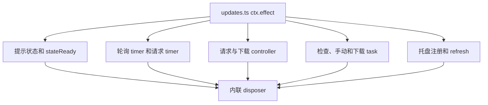
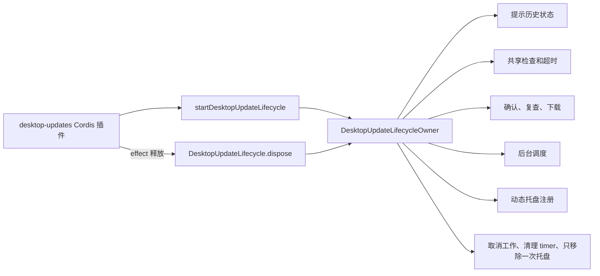

# Agent Note: Desktop 更新生命周期所有权

Status: implemented

[English](2026-08-19-desktop-update-lifecycle-ownership.md) | 中文

## 问题

`desktop-updates` Cordis 插件负责协调定时检查、手动检查、确认、下载交接、提示历史持久化、动态托盘状态、超时、取消和释放。修改前，所有可变状态都位于 `updates.ts` 的一个 `ctx.effect()` 闭包中：2 个 timer、2 个 `AbortController`、3 个 single-flight task、持久状态就绪过程、可用版本状态和托盘注册。

插件 interface 很小，但 implementation 难以审查生命周期正确性。要判断一代 Host 是否释放了全部更新工作，维护者必须阅读所有嵌套函数，并将每个状态变量与对应清理路径逐一匹配。更新操作本来就只有一个自然生命周期，因此其状态应该位于一个 generation-scoped seam 后面。

## 决策

保留公开的 `desktop-updates` Cordis 插件及其导出的 `Config`。新增私有 `DesktopUpdateLifecycle` module，其 interface 为：

```ts
startDesktopUpdateLifecycle(options): DesktopUpdateLifecycle
DesktopUpdateLifecycle.dispose(): Promise<void>
```

该 module 负责：

- 提示历史的加载、校验、替换和可选持久化；
- 后台调度 timer 和请求超时 timer；
- 手动检查与后台检查共享的版本请求；
- 用户确认后重新检查版本；
- 单个活跃下载及其取消 controller；
- 可用版本和下载中状态的托盘呈现及注册；
- generation 释放，包括幂等取消和托盘移除。

`updates.ts` 现在只校验 Cordis 配置、在一个 effect 中启动一代生命周期，并把 effect 释放委托给返回的 handle。它不再查看或修改生命周期状态。

## 升级前 / 升级后

升级前，一个插件闭包包含多条并行所有权路径：



升级后，Cordis 插件只持有一个 generation-scoped 生命周期 handle：



该 interface 小于 implementation，并为调用者提供 leverage：一次启动建立全部更新行为，一次释放结束这一代。删除该 module 只会把状态和清理规则重新放回 `updates.ts`，因此它确实为 seam 提供了深度。

## 生命周期不变量

对于一代更新生命周期：

1. 同时最多存在一个版本检查请求，手动调用者与后台调用者共享该请求。
2. 同时最多存在一个确认和下载 task。
3. 已确认版本必须在下载交接前重新检查。
4. 后台发现会注册 `open-update` 动作，在通知前记录版本，并且不会为同一个持久化版本重复发送通知。
5. 点击动作会进入与托盘命令相同的确认和重新检查路径；重复点击会共享现有的手工/下载 task。
6. 释放时先把 generation 标记为不再活跃，再释放通知动作、清理 timer、取消请求和下载，并移除托盘项。
7. 释放只等待状态就绪过程和可取消的版本请求。原生对话框仍不可取消，也不会阻塞 Host 释放。
8. 重复释放会返回同一个 task，只释放一次通知动作和托盘，并且不能重新启动轮询。

## 保持不变的行为和限制

- 更新状态改为 version 3，保持相同的 4 KiB 读取上限和原子 best-effort 持久化；version-2 提示历史迁移为 `lastNotifiedVersion`。
- 手动失败仍只通过现有原生结果对话框显示。定时检查、元数据、暂存、文件系统和 updater 失败继续保持静默，后台检查不会打断用户工作。
- 后台通知仍按持久化版本只发送一次，点击不会绕过确认或重新检查。
- 稳定版下载会重新检查清单，要求 Electron Updater 元数据命名该精确版本，并由 Electron Updater 在私有暂存后校验完整平台构件的 SHA-512，等待明确重启。
- 本次变更只为打包后的稳定 macOS/Windows 引入 `electron-updater`；不会自动下载、退出即安装、自动重试、远程 telemetry、Beta 构件，也不会绕过用户确认和明确重启。
- 原生确认和结果对话框仍不能取消。Owner 会阻止其延迟结果在释放后启动新工作。

## 验证

更新测试覆盖调度、version-3 状态迁移、通知动作注册/点击分发、确认/复查、single-flight/cancellation/disposal，以及 Electron Updater 版本/cancellation 行为。Host bridge 与 Electron 测试覆盖回调释放、聚焦、原生通知分发和重启交接。Release 验证检查已发布更新元数据 SHA-512 与手动下载 SHA-256 记录。

## 后果

以后更新 timer、操作 task、提示历史、托盘状态或 release 行为的变化应集中在 `update-lifecycle.ts`。`electron-auto-updater.ts` 负责窄范围的 Electron Updater 配置、版本相等性与 abort bridge；`electron-runtime.ts` 负责明确重启请求。`updates.ts` 继续作为 Cordis adapter 和配置 surface。
